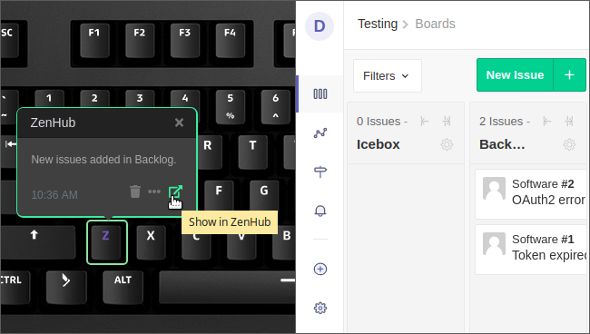

# ZenHub

Lights up a keyboard key whenever issues are moving inside boards.

ZenHub is the only project management tool that integrates natively within GitHub’s user interface.

For more information, visit <https://www.zenhub.com>.

> This applet doesn't support ZenHub Enterprise.
This applet uses ZenHub [API](https://github.com/ZenHubIO/API).
